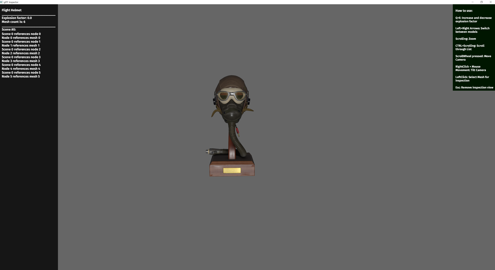
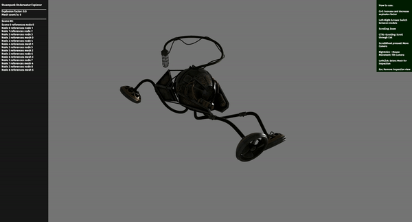
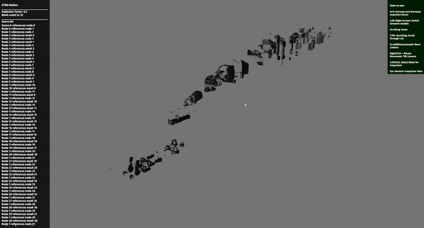
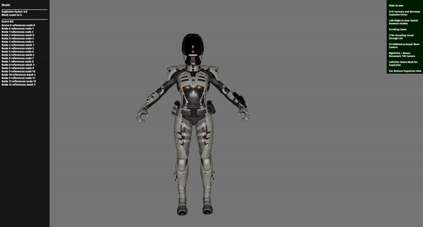

# glTF Inspector
## _Visualizer-Tool for glTF 3D models_

#
## Features
### Display and inspect glTF models 
Look at multiple glTF models from all angles by moving and rotating the camera

#

### Exploded-view to inspect every piece 
Every model can be exploded to display every individual piece 

#

### Highlight the path to whichever piece is clicked on 
Clicking on any glTF model piece will hightlight the glTF file path for said piece

#

## How to use
### Download and unzip
Download the latest version of the glTF Inspector [here](https://github.com/ThisIsKaluwa/glTF_Inspector/actions/runs/1928040748), unzip the archive and run the program 

The supported systems are:

- Windows
- Linux
- macOS

You might need to mark the glTF Inspector as an executable on macOS using this command:

`chmod u+x gltf_inspector`

after you have unpacked the archive and opened the shell in the target directory. 

